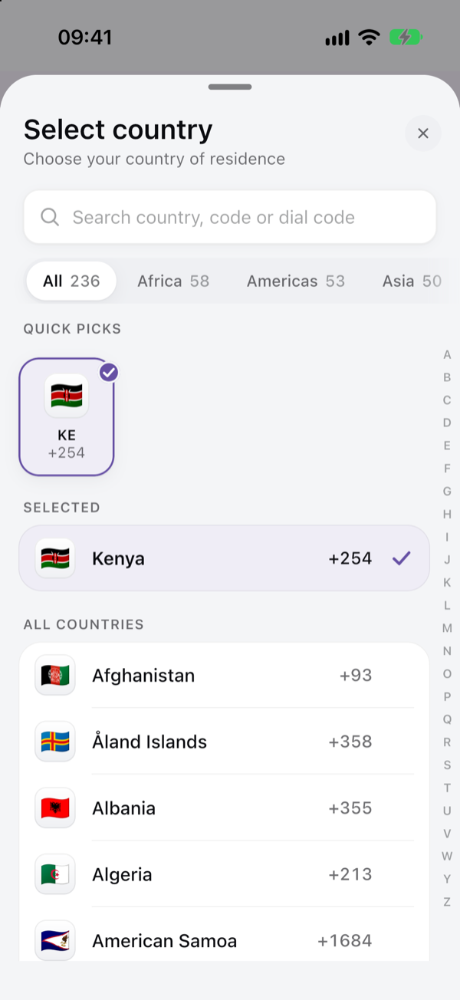
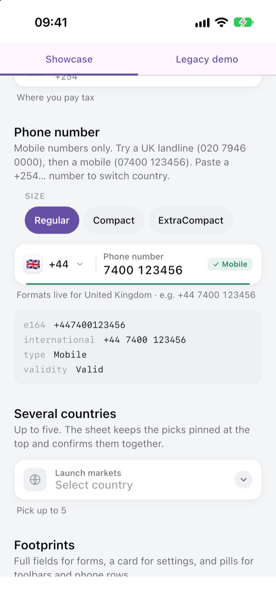
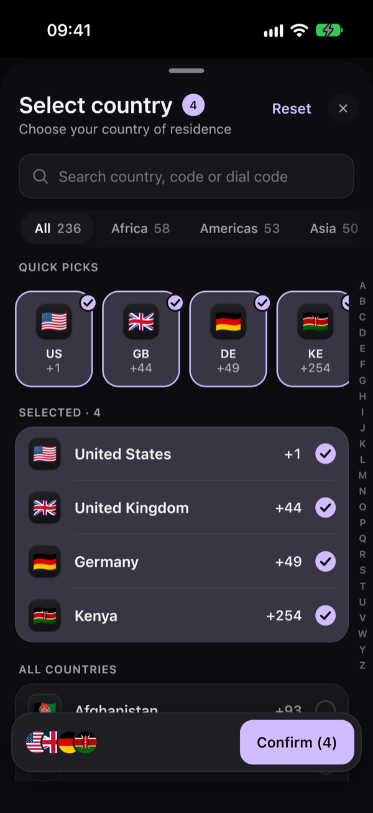
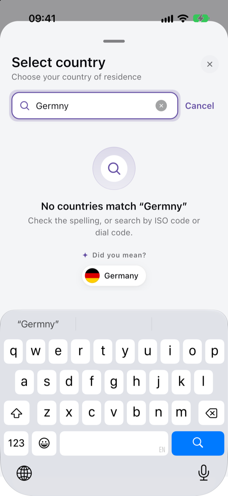
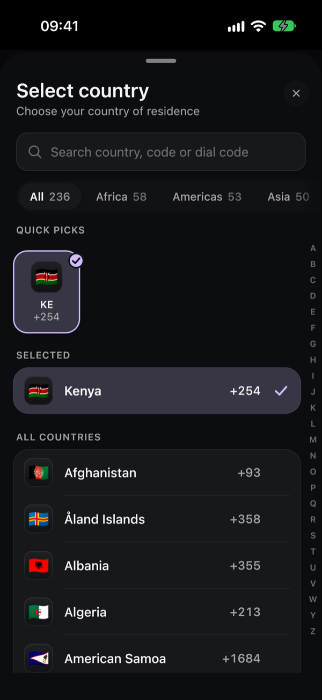
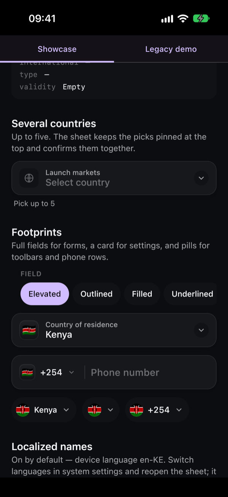

# Country Code Picker

[](https://jitpack.io/#EzekielWachira/Country-Code-Picker)

📖 **Documentation:** [ezekielwachira.github.io/Country-Code-Picker](https://ezekielwachira.github.io/Country-Code-Picker/) — guides, recipes and the [API reference](https://ezekielwachira.github.io/Country-Code-Picker/api/).

A lightweight, fully customizable **Compose Multiplatform** library for **Android and iOS**: country selection, country code selection, phone number validation, and real-time formatting based on country-specific rules — one API, written once in common code.

The library ships two layers:

- **[Country Picker](#country-picker-library)** — a general-purpose country-selection foundation:
  full/compact/flag-only/phone-prefix selectors, single and multi-selection, search, region filters,
  recents and suggestions, country detection, and an optional decoupled phone-verification flow.
- **[`PhoneNumberInput`](#legacy-phonenumberinput-api)** — the original phone-number component. It now
  runs on the Country Picker foundation internally, so existing call sites keep working unchanged; see
  [Migrating from `PhoneNumberInput`](#migrating-from-phonenumberinput) if you want to move to the newer
  API.

## Screenshots

The Signature style, with [flagcdn.com](https://flagcdn.com) flags, on iOS. The same code renders it on
Android.

<table>
  <tr>
    <td align="center"><br><sub>Country sheet</sub></td>
    <td align="center"><br><sub>Phone field</sub></td>
    <td align="center"><br><sub>Multiple selection</sub></td>
  </tr>
  <tr>
    <td align="center"><br><sub>"Did you mean"</sub></td>
    <td align="center"><br><sub>Dark mode</sub></td>
    <td align="center"><br><sub>Fields and pills</sub></td>
  </tr>
</table>

Every option above — presets, accent, density, list style, flag shape, format and frame — is a live
control in the sample app's **Showcase** tab.

## Features

- **A complete design system** – One `CountryPickerStyle` (colors, shapes, type, motion, elevation,
  layout, haptics) with Signature, Material, Cupertino and Minimal presets, three densities, light and
  dark, and a brand accent in one line
- **Real flag artwork** – Flags from [flagcdn.com](https://flagcdn.com) in its three shapes — waving
  4:3, original at a common width, original at a common height — as PNG, WebP, JPEG or SVG, cached,
  with the emoji as an offline fallback
- **Country Picker** – Searchable list of 236 countries and territories with flags and dial codes
- **Single and multi-selection** – One country, or several with Cancel / Reset / Confirm
- **Full, compact, flag-only and phone-prefix selectors** – Same sheet, different footprints
- **Region filters** – Africa, Americas, Asia, Europe, Oceania, plus an "All" view
- **Quick picks** – Recent, suggested and detected countries as a carousel of tiles, or as sections
- **Ranked search with "Did you mean"** – By name, ISO alpha-2/3, dial code, or alias —
  accent-insensitive, and a misspelling ("Germny") offers the country it nearly matched
- **A–Z index rail** – Scrub the full list with a magnified letter bubble and haptic ticks
- **Adaptive presentation** – A bottom sheet on phones, a centered dialog on tablets and desktops, or
  `CountryPickerPanel` inline
- **Android and iOS** – Every component works in shared `commonMain` code via Compose Multiplatform
- **Phone Number Validation** – Country-aware validation powered by Google libphonenumber on Android
  and its Objective-C port, libPhoneNumber-iOS, on iOS — generated from the same metadata, so a
  number validates the same way on both
- **Line-type restrictions** – Require a mobile number for SMS flows, not merely a valid one
- **Autofill** – Declares the right content types; an autofilled `+254…` adopts its own country
- **Real-time Formatting** – Formats to E.164, international, and national formats as the user types
- **Phone verification** – Optional, via a host-supplied `PhoneNumberVerificationHandler`
- **Max Length Enforcement** – Caps input at the correct digit count for the selected country
- **Auto Country Detection** – Detects from SIM → network → locale on Android and the Region setting
  on iOS, with fallback; never overrides an explicit user choice
- **State Hoisting** – Expose `CountryPickerState` / `PhoneState` to the caller for external control
- **Error / disabled / loading / success states** – On every selector variant
- **A premium phone field** – Floating label, ghost digits showing what is left to type, a progress
  hairline, and a `✓ Mobile` badge once the number is valid
- **Localized** – Ships Arabic, German, Spanish, French, Portuguese, Swahili and Simplified Chinese;
  country names come from the platform in every language it has data for
- **Right-to-left** – Mirrors correctly, and pins dial codes and phone numbers LTR so `+254` never
  renders as `254+`
- **Accessibility** – Full content description support (TalkBack; VoiceOver through Compose
  Multiplatform's accessibility bridge), 48dp touch targets, no color-only signaling
- **Compose-First API** – No ViewModels, no navigation coupling, pure Compose state

## Installation

### From Maven Central

In a Kotlin Multiplatform module, add it to `commonMain`:

```kotlin
kotlin {
    sourceSets {
        commonMain.dependencies {
            implementation("io.github.ezekielwachira:ccp:<LATEST_VERSION>")
        }
    }
}
```

In an Android-only module, as before:

```kotlin
dependencies {
    implementation("io.github.ezekielwachira:ccp:<LATEST_VERSION>")
}
```

`mavenCentral()` is in most projects' repository list already; nothing else to add. Gradle picks the
right artifact per target (`ccp-android`, `ccp-iosarm64`, `ccp-iossimulatorarm64`).

### iOS

Nothing beyond the Gradle dependency. The phone-number engine (libPhoneNumber-iOS) is compiled into
the library's iOS klib, so there is no CocoaPod, Swift package or linker flag to add, and an app that
also uses libPhoneNumber-iOS directly links fine — the embedded copy's symbols are prefixed.

Host the shared UI the usual Compose Multiplatform way, from your iOS source set:

```kotlin
fun MainViewController(): UIViewController = ComposeUIViewController {
    var country by remember { mutableStateOf<Country?>(null) }
    CountrySelector(selectedCountry = country, onCountrySelected = { country = it })
}
```

[`iosApp/`](iosApp) is a complete example: open `iosApp/iosApp.xcodeproj` in Xcode and run the
**CCP Sample** scheme. It builds the shared [`:sample`](sample) module — the same demo the Android
[`:app`](app) runs.

### From JitPack (Android only)

JitPack builds on Linux, which cannot produce the iOS artifacts, so use it only for Android-only
projects. Add the repository to your root `settings.gradle.kts`:

```kotlin
dependencyResolutionManagement {
    repositoriesMode.set(RepositoriesMode.FAIL_ON_PROJECT_REPOS)
    repositories {
        mavenCentral()
        maven { url = uri("https://jitpack.io") }
    }
}
```

```kotlin
dependencies {
    implementation("com.github.EzekielWachira:Country-Code-Picker:<LATEST_VERSION>")
}
```

### Optional (Android) — trim ~99 KB of unused metadata

libphonenumber ships three metadata blobs. The picker only ever reaches `PhoneNumberUtil` and
`AsYouTypeFormatter`, which need one of them:

| Blob | Size | Needed |
|---|---|---|
| `PhoneNumberMetadataProto` | ~235 KB | yes |
| `ShortNumberMetadataProto` | ~75 KB | only by `ShortNumberInfo` — unused here |
| `PhoneNumberAlternateFormatsProto` | ~23 KB | only by `PhoneNumberMatcher` — unused here |

If your app does not use those APIs either, drop the two unused blobs:

```kotlin
android {
    packaging {
        resources {
            excludes += setOf(
                "/com/google/i18n/phonenumbers/data/ShortNumberMetadataProto*",
                "/com/google/i18n/phonenumbers/data/PhoneNumberAlternateFormatsProto*",
            )
        }
    }
}
```

The sample app in this repository ships with these exclusions applied, so CI builds and tests the
configuration rather than only documenting it. A build task (`verifyPhoneNumberMetadataFootprint`)
fails the library's own build if it ever starts using an API that would need them back.

## Country Picker library

Everything below lives under `com.ezzy.ccp.countrypicker` — the country model, search, state, theme
and UI are all reusable independently of phone numbers. A sample screen reproducing the flow below is
in [`YourDetailsSampleScreen`](ccp/src/commonMain/kotlin/com/ezzy/ccp/countrypicker/sample/YourDetailsSampleScreen.kt),
and every state described here has a matching `@Preview` in
[`CountryPickerPreviews.kt`](ccp/src/commonMain/kotlin/com/ezzy/ccp/countrypicker/sample/CountryPickerPreviews.kt).

### A basic country selector

```kotlin
var country by rememberSaveable { mutableStateOf<Country?>(null) }

CountrySelector(
    selectedCountry = country,
    onCountrySelected = { country = it },
    label = UiText.of("Country of residence"),
)
```

`CountrySelector` is fully controlled: `selectedCountry` is the source of truth, and the component never
mutates it — a selection only ever arrives through `onCountrySelected`, carrying the complete `Country`
(ISO alpha-2/3, dial code, region, flag), never just a name or a code.

### Compact and flag-only variants

Same sheet, same behavior, smaller footprint — pick with `variant`:

```kotlin
CountrySelector(
    selectedCountry = country,
    onCountrySelected = { country = it },
    variant = CountrySelectorVariant.Compact,   // 🇩🇪 Germany ˅
    label = null,
)

CountrySelector(
    selectedCountry = country,
    onCountrySelected = { country = it },
    variant = CountrySelectorVariant.FlagOnly,  // 🇩🇪 ˅
    label = null,
)
```

The flag-only variant has no visible text, so it carries its own content description automatically —
`"Selected country: Germany. Double tap to change."` — no extra wiring needed.

### The phone country-code picker

```kotlin
CountrySelector(
    selectedCountry = country,
    onCountrySelected = { country = it },
    variant = CountrySelectorVariant.DialCode,  // 🇰🇪 +254 ˅
    label = null,
    config = CountryPickerDefaults.phoneConfig(),
)
```

In practice you won't call this directly — [`PhoneNumberField`](#the-phone-number-field) already embeds
it next to the number input.

### The phone number field and E.164 output

```kotlin
val phoneState = rememberPhoneNumberFieldState(initialCountry = kenya)

PhoneNumberField(
    state = phoneState,
    onValueChange = { value: PhoneNumberValue ->
        value.e164Number           // "+254712345678", or null while unparseable
        value.internationalNumber  // "+254 712 345678"
        value.isValid              // true only for a real, dialable number
    },
)
```

`PhoneNumberValue.e164Number` comes from libphonenumber, not from concatenating a dial code onto typed
digits — that concatenation is wrong for any region with a national trunk prefix (a UK mobile typed as
`07400 123456` is `+447400123456`, not `+4407400123456`). Never rebuild it by hand.

Changing the selected country keeps the digits the user already typed, reformats them for the new
region, and **revalidates** — a number valid in one country is never carried over as still-valid in
another.

### Validating a phone number

```kotlin
when (phoneState.value.validity) {
    PhoneNumberValidity.Empty -> Unit                 // nothing typed; show nothing
    PhoneNumberValidity.Incomplete -> Unit             // still typing; show nothing
    PhoneNumberValidity.Valid -> submit()
    else -> showError(PhoneNumberValidator.errorMessage(phoneState.value))
}
```

`PhoneNumberField` already shows/hides its own error text this way; reach for `PhoneNumberValidator`
directly only when you need the result before the user submits.

### Integrating phone verification

The library ships no verification backend on purpose — implement the one contract against your own
SMS/Firebase/whatever provider:

```kotlin
class MyVerificationHandler(private val api: MyAuthApi) : PhoneNumberVerificationHandler {
    override suspend fun requestVerification(phoneNumber: PhoneNumberValue) =
        api.sendCode(phoneNumber.e164Number!!).toRequestResult()

    override suspend fun verifyCode(verificationId: String, code: String) =
        api.checkCode(verificationId, code).toVerificationResult()

    override suspend fun resendCode(verificationId: String) =
        api.resendCode(verificationId).toRequestResult()
}

val verification = rememberPhoneVerificationController(MyVerificationHandler(api))

PhoneNumberField(
    state = phoneState,
    onValueChange = {},
    verificationController = verification,
)

Button(
    enabled = phoneState.value.isValid,
    onClick = { scope.launch { verification.requestCode(phoneState.value) } },
) { Text("Send code") }

when (val state = verification.state) {
    is PhoneVerificationState.CodeSent -> OtpEntry(onSubmit = { scope.launch { verification.submitCode(it) } })
    is PhoneVerificationState.Verified -> Text("Verified: ${state.e164Number}")
    is PhoneVerificationState.Failed -> Text(state.message.resolve())
    else -> Unit
}
```

Editing the phone number after a successful verification resets the flow to `Idle` automatically — a
form can never submit "verified" for a number the user has since changed.

### Allowed / excluded countries and region filters

```kotlin
CountryPickerDefaults.config(
    allowedCountryCodes = setOf("US", "CA", "GB", "KE"),   // null (default) = every country
    excludedCountryCodes = setOf("KP", "IR"),               // exclusion always wins
    showRegionFilters = true,
)
```

An **empty** `allowedCountryCodes` set is a real, deliberate configuration — it allows nothing, and the
sheet shows its own "no countries available" state rather than silently falling back to everything.

### Suggested and recent countries

```kotlin
CountryPickerDefaults.config(
    suggestedCountryCodes = listOf("US", "GB", "KE"),  // your call — the library assumes nothing
)

CountrySelector(
    selectedCountry = country,
    onCountrySelected = { country = it },
    recentCountryStore = rememberDefaultRecentCountryStore(),  // omit to persist nothing
)
```

Selected, Recent and Suggested are deduplicated against each other and against "All countries" — a
selected Germany never also shows up under Suggested.

### Multi-selection

```kotlin
var markets by rememberSaveable { mutableStateOf(emptySet<Country>()) }

MultiCountrySelector(
    selectedCountries = markets,
    onSelectionConfirmed = { markets = it },   // fires only when the user taps Confirm
    config = CountryPickerDefaults.multiSelectConfig(
        minimumSelectionCount = 1,
        maximumSelectionCount = 5,
    ),
)
```

Ticking rows edits a *pending* selection inside the sheet; Cancel and dismiss discard it, so
`selectedCountries` never changes except through `onSelectionConfirmed`.

### Country detection

```kotlin
CountrySelector(
    selectedCountry = country,
    onCountrySelected = { country = it },
    // Android: SIM → network → locale. iOS: the Region setting. No location permission either way.
    detector = rememberDefaultCountryDetector(),
    detectionBehavior = CountryDetectionBehavior.ShowBadge,
)
```

Detection never overrides a selection the user already made. `ShowBadge` applies the guess and labels
it ("From your SIM card · tap to change"); `AskFirst` surfaces it as a suggestion the user must accept;
`Silent` applies it with no explanation.

### Styling: presets, accent, flags and layout

Everything visual is one `CountryPickerStyle`. Pick a preset, give it your brand color, refine it with
`copy`, and set it once:

```kotlin
val style = CountryPickerStyles.signature(accent = Color(0xFF0F766E))  // or material(), cupertino(), minimal()

CountryPickerTheme(
    style.copy(
        layout = style.layout.copy(
            flagStyle = CountryFlagStyle.Circle,                    // Tile, Circle, Rounded, Plain, Hidden
            flagSource = CountryFlagSource.FlagCdn(
                shape = FlagImageShape.OriginalSameHeight,          // Waving, OriginalSameWidth, OriginalSameHeight
                format = FlagImageFormat.Svg,                       // Png, WebP, Jpeg, Svg
            ),
            listStyle = CountryListStyle.Cards,                     // InsetGrouped, Plain, Cards
            presentation = PickerPresentation.Adaptive,             // sheet on phones, dialog on tablets
        ),
    ),
) {
    CountrySelector(selectedCountry = country, onCountrySelected = { country = it })
    PhoneNumberField(onValueChange = { phone = it })
}
```

Presets follow your `MaterialTheme`'s light or dark mode and the system's reduced-motion setting.
`CountryFlagSource.Emoji` keeps everything offline. The sample app's **Showcase** tab lets you try
every option live. See [Theming](https://ezekielwachira.github.io/Country-Code-Picker/theming/).

## Legacy `PhoneNumberInput` API

The original phone-number component. Still fully supported — it now runs on the Country Picker
foundation internally (ranked search, the full 236-country dataset, `AsYouTypeFormatter`-based
grouping), but its public API is unchanged.

### Basic usage

```kotlin
PhoneNumberInput(
    onValueChange = { phone ->
        // phone.formattedPhone  → "+254 724 154 958"
        // phone.phoneNumber     → "+254724154958" (E.164)
        // phone.country         → SelectedCountry(name, code, dialCode, flag)
        // phone.isValid         → true / false
    }
)
```

### State hoisting

Hoist `PhoneState` when you need to read state or drive the field from outside the composable — for example to clear it after form submission, or to validate on button tap.

```kotlin
val phoneState = rememberPhoneState()

PhoneNumberInput(
    state = phoneState,
    onValueChange = { phone -> ... }
)

Button(onClick = {
    if (phoneState.isValid) submit(phoneState.toPhone())
    else phoneState.clearPhone()
}) {
    Text("Submit")
}
```

### Picker style — bottom sheet vs dropdown

```kotlin
// Default: full-screen bottom sheet
PhoneNumberInput(
    ccpConfig = CCPDefaults.defaultConfig(
        countryPickerStyle = CountryPickerStyle.BottomSheet
    )
)

// Compact inline dropdown (better for tablets / landscape)
PhoneNumberInput(
    ccpConfig = CCPDefaults.defaultConfig(
        countryPickerStyle = CountryPickerStyle.Dropdown
    )
)
```

### Error state

```kotlin
var isError by remember { mutableStateOf(false) }

PhoneNumberInput(
    isError = isError,
    errorMessage = "Please enter a valid phone number",
    onValueChange = { phone ->
        isError = !phone.isValid && phone.phoneNumber.isNotEmpty()
    }
)
```

### Pre-fill and country override

```kotlin
PhoneNumberInput(
    value = "+254724154958",   // pre-fill in E.164 format; country is auto-detected
    setCountry = "KE",        // or force a specific country (overrides auto-detection)
)
```

### Country filtering

```kotlin
PhoneNumberInput(
    // Show only these countries
    countriesToShow = listOf("US", "GB", "KE", "FR", "AU"),

    // Or hide specific ones
    countriesExclude = listOf("KP", "IR"),

    // Pin frequently-used countries to the top of the picker
    pinnedCountries = listOf("US", "GB", "KE"),
)
```

### Clear button

```kotlin
PhoneNumberInput(
    ccpConfig = CCPDefaults.defaultConfig(showClearButton = true)
)
```

### Auto country detection

```kotlin
PhoneNumberInput(
    ccpConfig = CCPDefaults.defaultConfig(autoDetectCountry = true)
    // Android: SIM → network → configuration locale → default locale → US
    // iOS: Region setting → US
)
```

### Max length enforcement

Input is capped at the correct digit count for the selected country by default. Disable it if needed:

```kotlin
PhoneNumberInput(
    ccpConfig = CCPDefaults.defaultConfig(enforceMaxLength = false)
)
```

### Default country list layout

```kotlin
PhoneNumberInput(
    ccpConfig = CCPDefaults.defaultConfig(
        defaultCountryListStyle = CountryListStyle.Grid // or CountryListStyle.List
    )
)
```

### Keyboard Done action

```kotlin
PhoneNumberInput(
    onDone = {
        // Called only when isValid == true and the user taps Done
        submitForm()
    }
)
```

### Customizing colors

```kotlin
PhoneNumberInput(
    colors = CCPDefaults.colors(
        containerColor = Color.White,
        borderColor = Color.Gray,
        errorBorderColor = Color.Red,
        errorColor = Color.Red,
        cursorColor = Color.Black,
        inputTextColor = Color.DarkGray,
        phoneHintColor = Color.LightGray,
    )
)
```

### Customizing shapes and typography

```kotlin
PhoneNumberInput(
    ccpConfig = CCPDefaults.defaultConfig(
        phoneInputShape = RoundedCornerShape(8.dp),
        borderWidth = 1.dp,
        showCountryFlag = true,
        showHeader = true,
        showCountriesHeaderDivider = true,
        readOnly = false,
    )
)
```

### API Reference

### `PhoneNumberInput` parameters

| Parameter | Type | Default | Description |
|---|---|---|---|
| `modifier` | `Modifier` | `Modifier` | Applied to the outer Column |
| `state` | `PhoneState` | `rememberPhoneState()` | Hoistable state holder |
| `phoneHint` | `String` | `"Enter phone"` | Placeholder text |
| `onValueChange` | `(Phone) -> Unit` | `{}` | Called on every change |
| `onDone` | `() -> Unit` | `{}` | Called on IME Done (only when valid) |
| `value` | `String` | `""` | Initial phone number (E.164 or local) |
| `setCountry` | `String?` | `null` | ISO code or name to preselect |
| `countriesToShow` | `List<String>` | `emptyList()` | Whitelist of ISO codes |
| `countriesExclude` | `List<String>` | `emptyList()` | Blacklist of ISO codes |
| `pinnedCountries` | `List<String>` | `emptyList()` | ISO codes pinned to top of picker |
| `isError` | `Boolean` | `false` | Show error border and message |
| `errorMessage` | `String?` | `null` | Text shown below field when `isError` |
| `colors` | `CCPColors` | `CCPDefaults.colors()` | Color configuration |
| `ccpConfig` | `CCPConfig` | `CCPDefaults.defaultConfig()` | Behavior and UI configuration |

### `PhoneState`

| Member | Type | Description |
|---|---|---|
| `activeCountry` | `Country?` | Currently selected country |
| `phoneNumber` | `String` | Raw digit string |
| `formattedPhone` | `String` | International format e.g. `+254 724 154 958` |
| `unformattedPhone` | `String` | E.164 format e.g. `+254724154958` |
| `isValid` | `Boolean` | Whether the number is valid for the country |
| `selectCountry(Country)` | `fun` | Set active country and reformat |
| `setCountryByCode(String)` | `fun` | Set country by ISO code |
| `updatePhoneNumber(TextFieldValue)` | `fun` | Update field and reformat |
| `parseAndSet(String)` | `fun` | Parse E.164 string, auto-detect country |
| `clearPhone()` | `fun` | Reset field and all derived state |
| `toPhone()` | `fun` | Snapshot current state as `Phone` |

### `Phone`

```kotlin
data class Phone(
    val formattedPhone: String,       // e.g. "+254 724 154 958"
    val phoneNumber: String,          // E.164 e.g. "+254724154958"
    val country: SelectedCountry?,    // name, code, dialCode, flag
    val isValid: Boolean
)
```

### `CCPConfig` options

| Property | Type | Default | Description |
|---|---|---|---|
| `autoDetectCountry` | `Boolean` | `false` | Detect country from SIM / locale |
| `countryPickerStyle` | `CountryPickerStyle` | `BottomSheet` | `BottomSheet` or `Dropdown` |
| `defaultCountryListStyle` | `CountryListStyle` | `List` | `List` or `Grid` |
| `showClearButton` | `Boolean` | `false` | Show × button inside input |
| `enforceMaxLength` | `Boolean` | `true` | Cap digits at country's max |
| `readOnly` | `Boolean` | `false` | Disable input and country selector |
| `showCountryFlag` | `Boolean` | `true` | Flag emoji in the selector button |
| `showHeader` | `Boolean` | `true` | Letter headers in country list |
| `showCountriesHeaderDivider` | `Boolean` | `true` | Divider next to letter headers |
| `showFlagCountryItem` | `Boolean` | `true` | Flag in each country row |
| `showDialCodeCountryItem` | `Boolean` | `true` | Dial code in each country row |
| `borderWidth` | `Dp` | `0.dp` | Input field border thickness |
| `phoneInputShape` | `Shape` | `RoundedCornerShape(16.dp)` | Input container shape |
| `countriesSheetShape` | `Shape` | `RoundedCornerShape(top=16.dp)` | Bottom sheet shape |
| `searchCornerRadius` | `Dp` | `16.dp` | Search field corner radius |
| `searchBorderWidth` | `Dp` | `1.dp` | Search field border thickness |

### `CCPColors` options

| Property | Default | Description |
|---|---|---|
| `containerColor` | `colorScheme.background` | Input background |
| `borderColor` | `colorScheme.outline` | Normal border |
| `errorBorderColor` | `colorScheme.error` | Error state border |
| `errorColor` | `colorScheme.error` | Error message text |
| `cursorColor` | `colorScheme.primary` | Text cursor |
| `inputTextColor` | `colorScheme.onSurface` | Entered number text |
| `phoneHintColor` | `colorScheme.onSurfaceVariant` | Placeholder text |
| `countryCodeTextColor` | `colorScheme.onSurface` | Dial code in selector |
| `countryChevronColor` | `colorScheme.onSurface` | Chevron icon |
| `ccpSheetColor` | — | All bottom sheet / dropdown colors (see `CCPSheetColor`) |

## Migrating from `PhoneNumberInput`

You do not have to migrate — `PhoneNumberInput` is fully supported and now runs on the Country Picker
foundation internally, so it already benefits from the bigger dataset, ranked search and progressive
formatting without any change on your part.

Move to the newer API when you want things `PhoneNumberInput` doesn't expose: multi-selection, region
filters, recents/suggestions, or phone verification. The building blocks map like this:

| Old | New |
|---|---|
| `PhoneNumberInput(...)` | `PhoneNumberField(state = rememberPhoneNumberFieldState(...), ...)` |
| `PhoneState` | `PhoneNumberFieldState` (`nationalDigits`, `value: PhoneNumberValue`, `selectCountry`, `clear`) |
| `Phone` | `PhoneNumberValue` (`e164Number`, `internationalNumber`, `isValid`, `validity`) |
| `Country` (`com.ezzy.ccp.model`) | `Country` (`com.ezzy.ccp.countrypicker.model`) — adds ISO alpha-3, region, aliases |
| `countriesToShow` / `countriesExclude` | `CountryPickerConfig.allowedCountryCodes` / `excludedCountryCodes` |
| `pinnedCountries` | `CountryPickerConfig.suggestedCountryCodes` |
| `CCPConfig.autoDetectCountry` | `detector = rememberDefaultCountryDetector()` |
| `CCPColors` / `CCPConfig` shape params | `CountryPickerColors` / `CountryPickerShapes` via `CountryPickerDefaults` |
| — (did not exist) | `MultiCountrySelector`, region filters, `PhoneNumberVerificationHandler` |

A couple of behaviors changed as part of the underlying migration — both are described in the doc
comments on [`countryList`](ccp/src/commonMain/kotlin/com/ezzy/ccp/data/Data.kt) and
[`PhoneState`](ccp/src/commonMain/kotlin/com/ezzy/ccp/state/PhoneState.kt):

- The bundled country list grew from ~200 to 236 entries, and a few names now follow current ISO usage
  (`"Czech Republic"` → `"Czechia"`, `"Turkey"` → `"Türkiye"`) — former names remain searchable as
  aliases.
- Dial codes for NANP territories no longer contain hyphens (`"+1-809"` → `"+1809"`); the hyphenated
  form was not valid and broke E.164 normalization.
- The field now groups digits as you type (previously it stayed ungrouped until the number parsed
  cleanly), and `unformattedPhone`/E.164 output is empty rather than echoing raw input while a number
  is unparseable.

## Demo

https://github.com/user-attachments/assets/f2c7c5b9-85dc-4e4a-9909-4ae57490d561

## License

```
Copyright (c) 2025 Ezekiel Wachira

Permission is hereby granted, free of charge, to any person obtaining a copy
of this software and associated documentation files (the "Software"), to deal
in the Software without restriction, including without limitation the rights
to use, copy, modify, merge, publish, distribute, sublicense, and/or sell
copies of the Software, and to permit persons to whom the Software is
furnished to do so, subject to the following conditions:

The above copyright notice and this permission notice shall be included in all
copies or substantial portions of the Software.

THE SOFTWARE IS PROVIDED "AS IS", WITHOUT WARRANTY OF ANY KIND, EXPRESS OR
IMPLIED, INCLUDING BUT NOT LIMITED TO THE WARRANTIES OF MERCHANTABILITY,
FITNESS FOR A PARTICULAR PURPOSE AND NONINFRINGEMENT. IN NO EVENT SHALL THE
AUTHORS OR COPYRIGHT HOLDERS BE LIABLE FOR ANY CLAIM, DAMAGES OR OTHER
LIABILITY, WHETHER IN AN ACTION OF CONTRACT, TORT OR OTHERWISE, ARISING FROM,
OUT OF OR IN CONNECTION WITH THE SOFTWARE OR THE USE OR OTHER DEALINGS IN THE
SOFTWARE.
```

## Contributing

```bash
./gradlew :ccp:verifyRoborazziAndroidHostTest :ccp:iosSimulatorArm64Test :ccp:checkKotlinAbi :ccp:lint
```

The iOS targets need macOS with Xcode. CI runs those on every pull request (the iOS ones on a macOS
runner), plus an assemble of the library, the Android sample app and the iOS sample app, and the
Compose UI tests on emulators at API 26 and 34.

Source sets: shared code and the tests that run on both platforms live in `commonMain` /
`commonTest`; platform code in `androidMain` / `iosMain`; Robolectric and screenshot tests in
`androidHostTest`; Compose UI tests in `androidDeviceTest`. Kotlin/Native does not allow commas in
backticked test names, so `commonTest` names avoid them.

Three of them are worth explaining:

- **`verifyRoborazziAndroidHostTest`** runs the JVM tests and diffs the screenshot suite against the
  goldens in `ccp/src/androidHostTest/screenshots`. Re-record deliberately with
  `./gradlew :ccp:recordRoborazziAndroidHostTest` and review the image diff.
- **`checkKotlinAbi`** compares the compiled public API of every target against the dumps in
  `ccp/api/` (`android/ccp.api`, `ccp.klib.api`). The module is in Kotlin explicit-API mode, so every
  public declaration states its visibility and return type, and any change to the published ABI has
  to be an explicit commit. When a change is intended, run `./gradlew :ccp:updateKotlinAbi` and
  commit the diff — that diff *is* the API review.
- **`lint`** treats warnings as errors and has no baseline file. The module sits at zero findings; a
  baseline would only let the next regression be recorded rather than fixed.

### The vendored iOS phone-number engine

`ccp/src/nativeInterop/libPhoneNumber-iOS` is an unmodified copy of libPhoneNumber-iOS (version in its
`VERSION` file, Apache-2.0 licence alongside). `scripts/build-libphonenumber-ios.sh` compiles it per
iOS target with every global symbol renamed by `ccp_libphonenumber_namespace.h`, and fails if any
symbol escapes the prefix. To update it, copy the new release's `libPhoneNumber/` and
`libPhoneNumberInternal/` headers and sources over the old ones, update `VERSION`, and bump
`lib-phone` in `gradle/libs.versions.toml` to the libphonenumber release the new metadata was
generated from, so Android and iOS stay on the same data.

### Releasing

Push a `v*` tag. `.github/workflows/release.yml` writes the version from the tag into
`gradle.properties`, re-runs the full verification, publishes to Maven Central and drafts the GitHub
release. It needs `MAVEN_CENTRAL_USERNAME`, `MAVEN_CENTRAL_PASSWORD`, `SIGNING_KEY` and
`SIGNING_KEY_PASSWORD` as repository secrets.
