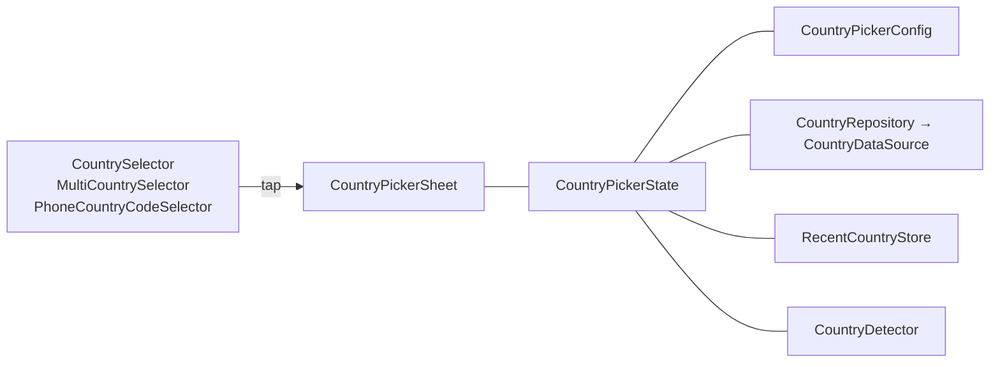

# Country picker

Everything under `com.ezzy.ccp.countrypicker` is a general-purpose country-selection foundation. It
is reusable independently of phone numbers: country of residence, nationality, supported markets,
shipping destinations, billing country.

## How the pieces fit



- A **selector** is the tappable field you place in a form. It shows the current value and opens the
  sheet. All variants open the *same* sheet with the *same* configuration; they differ only in
  footprint.
- The **sheet** is a Material 3 `ModalBottomSheet` on phones and a centered dialog on wide windows,
  with a search field, a sliding region filter, a carousel of quick picks (recent, suggested and
  detected countries), and a grouped list with an A–Z rail. `CountryPickerPanel` is the same picker
  with no container, for a full-screen route or a pane.
- **`CountryPickerState`** owns the sheet's *transient* state: visibility, query, region, and the
  *pending* selection. It never owns the *confirmed* selection; that is hoisted to you.
- **`CountryPickerConfig`** describes *how* a picker behaves: allowed and excluded countries, recents
  and suggestions, search fields, selection bounds. How it *looks* is a
  [`CountryPickerStyle`](../theming.md).
- Data, recents and detection are pluggable interfaces with sensible local defaults, so the picker
  works offline and writes nothing to disk unless you ask.

## Controlled components

Every selector follows the same contract:

```kotlin
var country by rememberSaveable { mutableStateOf<Country?>(null) }

CountrySelector(
    selectedCountry = country,            // you own this
    onCountrySelected = { country = it }, // the only way it changes
)
```

The component never mutates your value. A selection arrives through the callback carrying the full
[`Country`](data.md#the-country-model), so you never look one up by name or dial code.

## In this section

| Page | What it covers |
|---|---|
| [Country selector](selector.md) | `CountrySelector`, its six variants, states, labels, slots, and using the sheet on its own |
| [Configuration](configuration.md) | `CountryPickerConfig` and the `CountryPickerDefaults` factories: allow/exclude lists, regions, sections, search |
| [Multi-selection](multi-select.md) | `MultiCountrySelector`, pending vs. confirmed selection, min/max bounds |
| [Country detection](detection.md) | `CountryDetector`, `DefaultCountryDetector`, badge and ask-first behaviours |
| [Data, search and recents](data.md) | The `Country` model, the bundled dataset, custom data sources, ranked search, `RecentCountryStore` |
